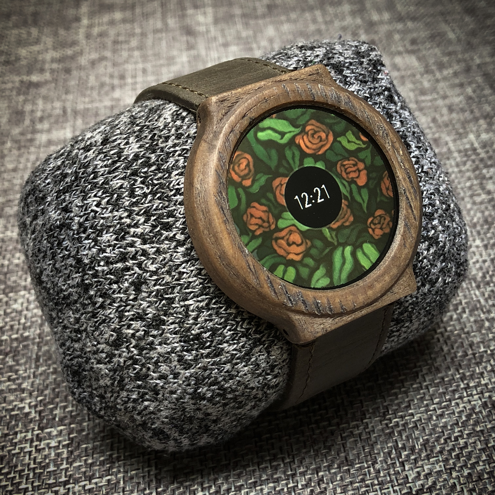

# smarchWatch_PUBLIC

I decided sometime last year that I wanted to make a smart watch from scratch. I am an electrical engineer and product designer by day, so this was a fun side project that had been rolling around in my head for a while now.

## If you want to order PCBs from the same place I did, you can [click this link](https://www.pcbway.com/project/shareproject/smarchWatch.html).

## For more info on the build process, [click here](https://imgur.com/a/FSBwD3g).

## For any ideas or things you wish could be in the project [click here](https://github.com/S-March/smarchWatch_PUBLIC/issues/15)

